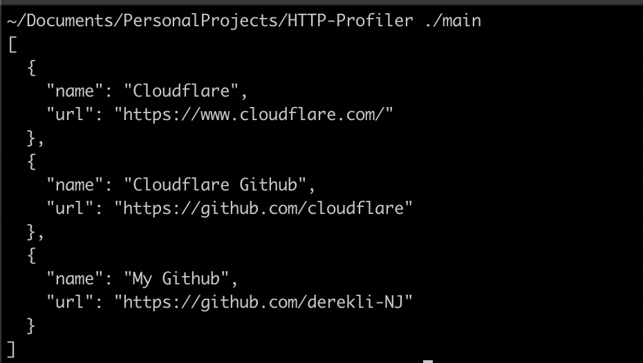
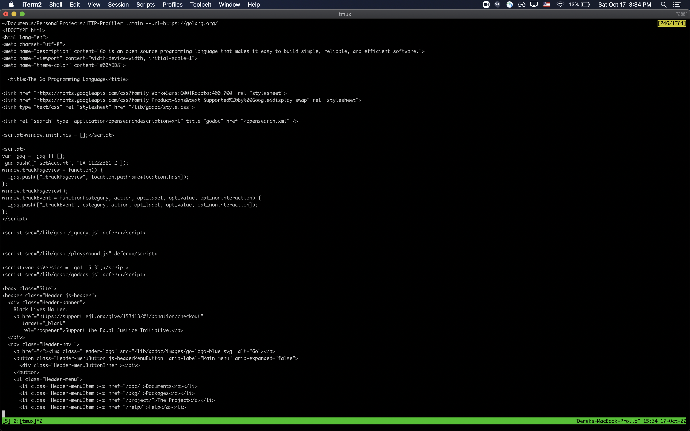
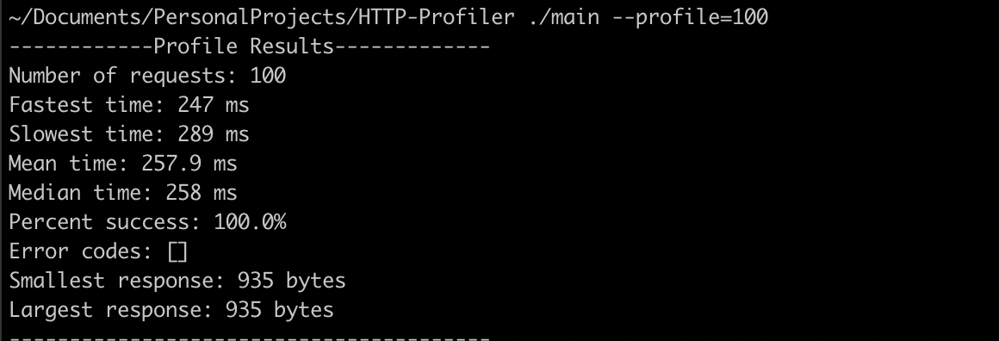
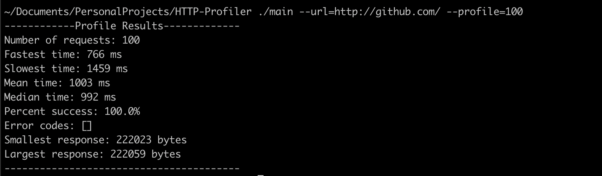
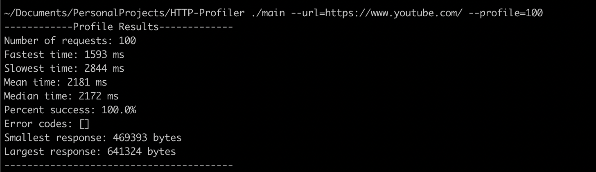
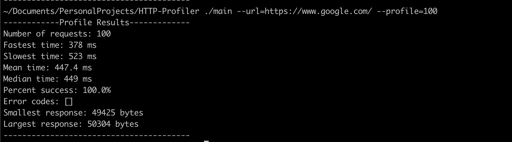
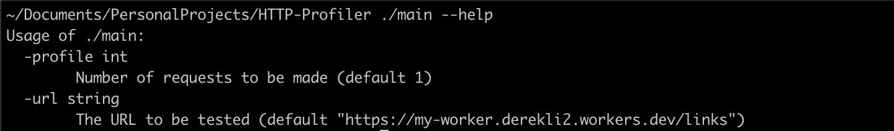

# HTTP-Profiler

My first project using Golang

## What does it do?

HTTP-Profiler is a CLI tool that makes a GET request to a HTTP endpoint TLS sockets rather than the native HTTP library. The tool can either output the response to the console or send a user specified amount of requests and profile the endpoint. Requests are made using Goroutines and channels so that multiple requests can be made concurrently.

### Metrics Provided:
* Number of requests
* Fastest time
* Slowest time
* Mean time 
* Median time
* Percent success
* Any error codes
* Smallest response size
* Largest response size

## Setup and Installation

* Install [Golang](https://golang.org/doc/install)
* Clone repo

And that's it!

## Usage

Build:
```
go build main.go
```

See response of a site
```
./main --url=https://github.com/derekli-NJ/HTTP-Profiler
```

Profile a site
```
./main --url=https://github.com/derekli-NJ/HTTP-Profiler --profile=10
```

### Flags
* `--url=<URL>` The URL that a request will be made to
* `--profile=<NUMBER OF REQUESTS>` Profiles the specified URL <NUMBER OF REQUESTS> times
* `--help` See usage

## Examples
Sites Profiled: Googlle, Github, YouTube, Golang.org, https://my-worker.derekli2.workers.dev/links

Default flags:


Golang.org response:


Profile default w/100 requests:


Profile Github w/100 requests:


Profile YouTube w/100 requests:


Profile Google w/100 requests:


Help page:


## Notes
* Connection request will timeout if there's no response after 5 seconds

